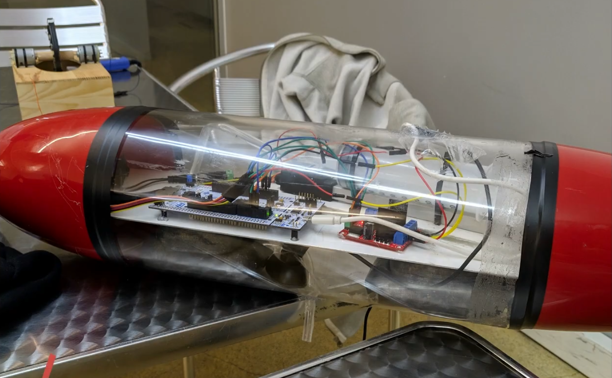

#     STM32---Control-of-a-Submergible

This repository contains the source code and documentation for a university project completed in 2019. The project involves the development of  a submergible vehicle with a control system with an STM32 microcontroller.

## Project Overview

The project, titled **"STM32 - Control of a Submersible"**, was developed by a group of students as part of the Integrated Practices Laboratory course. The primary objective was to design and implement  a submergible vehicle with a control system capable of managing the operations of, including movement, depth control, and other critical functions. The project report provides a comprehensive overview of the system's functionality, design choices, and implementation details.

## File Structure

- **STM32 - Control of a submergible.pdf**: The detailed project report, including the functional specifications, system design, and user manual for the submersible vehicle.
- **code/**: Directory containing the source code and project files necessary to build and run the control system on an STM32 microcontroller.
  - **.mxproject**: Project configuration file.
  - **Drivers/**: Contains the hardware drivers required by the project.
  - **Inc/**: Header files for the project.
  - **MDK-ARM/**: Files related to the ARM development environment.
  - **Src/**: Source code files.
  - **Submarino.ioc**: STM32CubeMX configuration file.

## Functional Specifications

The system was designed to meet the following functional specifications:

- **Movement Control**: Ability to control the submergible's movement in various directions.
- **Depth Control**: Mechanisms to adjust and maintain the submergible's depth underwater.
- **User Interface**: A user manual is provided in the report to guide operators in controlling the submergible.

## Getting Started

### Prerequisites

To work with this project, you will need:

- **STM32CubeMX**: To open and modify the `.ioc` file.
- **Keil MDK-ARM**: For compiling and debugging the source code.
- **STM32CubeIDE**: Alternatively, you can use STM32CubeIDE if you prefer an integrated development environment.

## Project Video

Watch the project in action on [YouTube](https://www.youtube.com/watch?v=GcWL44Fw8ew).

## Acknowledgments

This project was completed as part of a university course in 2019. Special thanks to the professors Paulo Carvalhal and Luís Gonçalves for their guidance and support throughout the development process.
